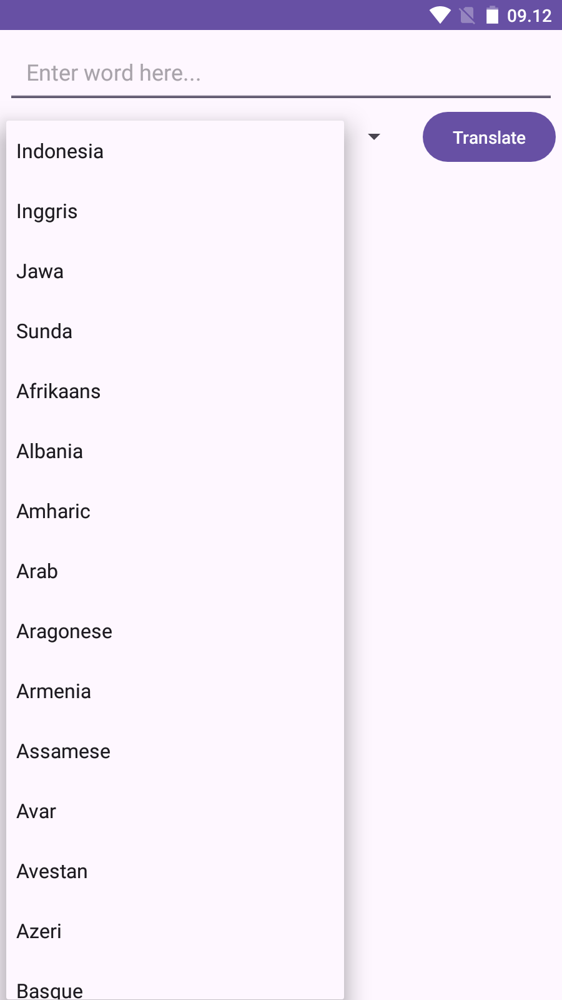

# Translation Kotlin

 Simple Gemini Chatbot AI App Using Kotlin In Android Studio SDK 34

 
 
## Instalation
- Clone Repositories
```
https://github.com/fitri-hy/chatbot-gemini-kotlin.git
```
- Import Project in Android Studio
- Run / Build Project

## Supported Grandle
```
compileSdk = 34
minSdk = 24
targetSdk = 34
```

Support me by giving stars. Hope it is useful.
